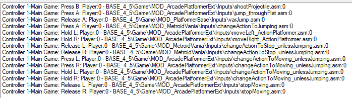

# MagicRock

This project is a custom module for the [NESMaker](https://www.thenew8bitheroes.com/) game engine based on the [`ArcadePlatformerBase` module](https://www.thenew8bitheroes.com/learn). 

This module introduce a mechanic I'm working for a future puzzle game, which is turning enemies into blocks where you can use to reach inacessible platforms.

This project does not contain a working game, but only exploratory code to make the main mechanic work.

I started a [thread at the NESMakers Forum](https://www.nesmakers.com/index.php?threads/magic-blocks-mechanic-wip.7315) for discussions around this project and to post updates. Also, there's a [few videos on YouTube](https://www.youtube.com/playlist?list=PLw-NO2HQOQPgAU_QSE9ccK5qnW_ptlmjz) if you're interested to see some "gameplay" and NESMaker hacks.

## How to use it

Ideally you should use this project only as a reference to build your own since I won't distribute the assets (they are not mine).
But if you want to hack around it, here you go:

1) Create a new project based on the `ArcadePlatformBase` module
2) Clone this repository and move or copy it to `GameEngineData/Routines/BASE_4_5/Game/MOD_MagicRock` folder.
3) Replace the scripts in this module using the Project, Project Settings, Script Settings tab.
4) Add the `colInfo` to the custom variables (Project, Project Settings, User Variables).

### Input Scripts

The screenshot below shows the input configuration I used in the project:

_MOD_ArcadePlatformerExt is the name I gave to this custom module on my local file system._

## License

You can do whatever you want with this code, but if you're going to use it in your game, I ask you to also open the source of your custom module and give the proper credits. To make my previous statement clear: **you're not allowed to use this code if you don't open your code as well**.

NESMaker is a paid engine, and I don't own the rights of it. The closer I could find of a license is [this post on tumblr](https://thenew8bitheroes.tumblr.com/post/184948012074/nesmaker-publishing). I also copied his post on the [`LICENSE.md`](LICENSE.md) file in this project. Please read.

## Credits

- Assets used in this concept by [ansimuz](https://ansimuz.itch.io/grotto-escape-game-art-pack)
- [NESMakers](https://www.nesmakers.com/) community
- [Tutorials](https://www.thenew8bitheroes.com/learn) made by Joe :)

## Contact

Feel free to open an issue, a pull request or reach out to me at the [NESMakers forums](https://www.nesmakers.com/index.php?members/chains.21144/) or [Twitter](https://twitter.com/zaninirica).
